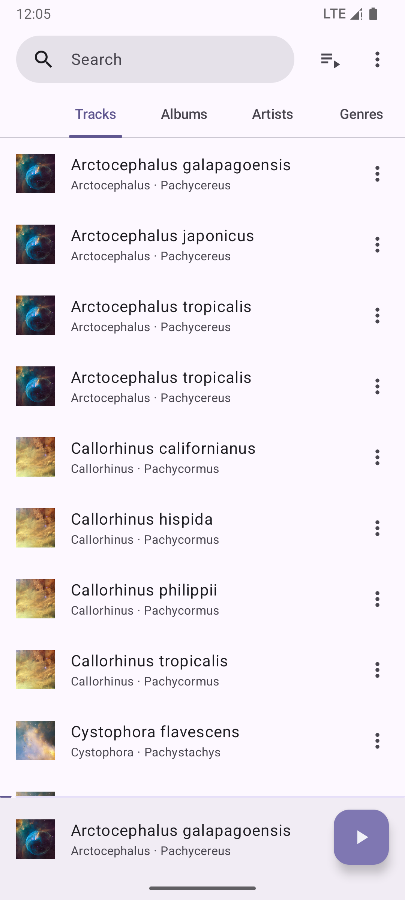
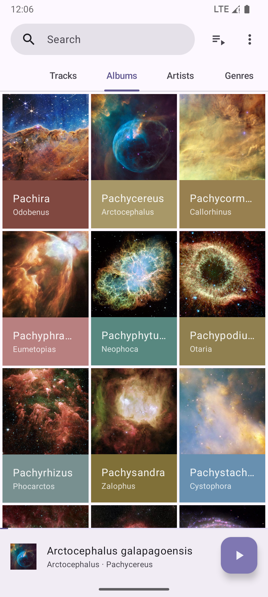
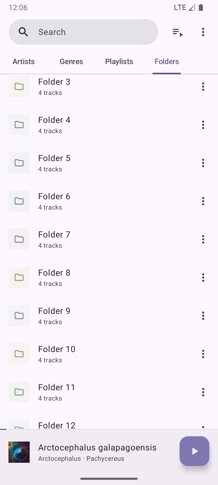
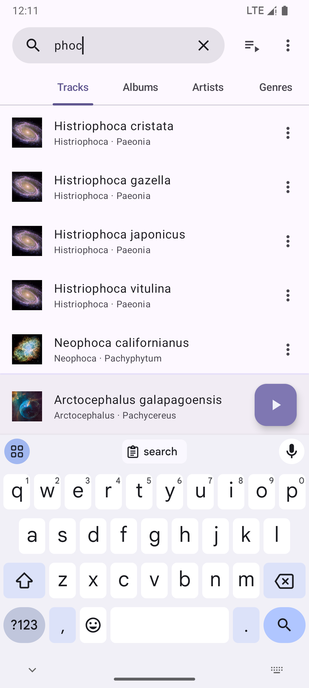
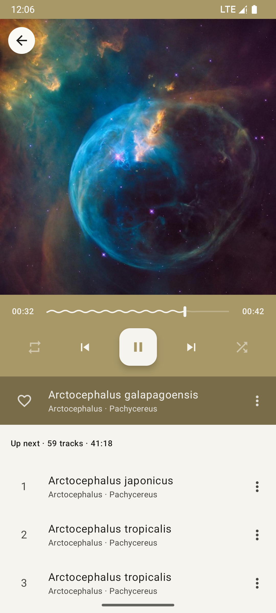

= Phocid

image:https://img.shields.io/f-droid/v/org.sunsetware.phocid[F-Droid Version,link=https://f-droid.org/en/packages/org.sunsetware.phocid/]
image:https://img.shields.io/badge/official-website-blue[Official website,link=https://sunsetware.org/phocid]
image:https://img.shields.io/badge/works_on-my_machine-yellow[Works on my machine]
image:https://img.shields.io/github/license/tjysunset/phocid[License]

A modern offline music player with familiar designs for Android 11+.

This project aims to be a replacement with personal tweaks for the now-defunct https://github.com/kabouzeid/Phonograph[Phonograph] music player, but has no connections with it.

== Features

* Familiar user experience
* Better metadata support; Namely, multiple artists.
* Better sorting when your music library differs from your system language
* Regex-based blacklist
* Playback speed and pitch control
* More lyrics styles
* Optional less-vibrant colors
* Brand new design based on Material Design 3

== Missing features compared to Phonograph

=== Features that are intentionally left out

* Tag editing
+
The scene of audio file tagging is a disaster.
The best metadata support library I could find is still buggy; I recommend using well-known dedicated software for this task.
* Deleting files
* Anything that requires an internet connection
* Lock screen

=== Features that might be added

These features are hard to implement and/or of no personal interest.
If you want to see a feature, please https://github.com/TJYSunset/Phocid/issues[file an issue].

* Draggable scrollbars
+
Waiting for Google's official implementation (which should be released as alpha after a century, and `@Deprecated` on the second day).
* Playback statistics
* Widgets
* Notification customization

== Known issues

* Library scanning with "Advanced metadata extraction" enabled can take up to 30 seconds depending on your library size.
I believe it is because the library used to read audio metadata is inherently slow.
I'm seeking to replace it with a home-brewed solution.

== Reporting a crash

A crash report should have been saved to `Android/data/org.sunsetware.phocid/files/crash.txt` in your external storage.
Please https://github.com/TJYSunset/Phocid/issues[create an issue] with the report attached.

NOTE: Depending on your system, you might need to connect your phone to a computer to see this file.

WARNING: This file contains uncensored logs.
Although it should not contain sensitive information, you are responsible for checking whether this holds true.

== License

=== App icon artwork

....
This work by tjysunset is licensed under CC BY-SA 4.0. To view a copy of this license, visit https://creativecommons.org/licenses/by-sa/4.0/
....

=== Code

....
Phocid
Copyright (C) tjysunset <tjysunset@outlook.com>

This program is free software: you can redistribute it and/or modify it under the terms of the GNU General Public License as published by the Free Software Foundation, either version 3 of the License, or (at your option) any later version.

This program is distributed in the hope that it will be useful, but WITHOUT ANY WARRANTY; without even the implied warranty of MERCHANTABILITY or FITNESS FOR A PARTICULAR PURPOSE. See the GNU General Public License for more details.

You should have received a copy of the GNU General Public License along with this program. If not, see <https://www.gnu.org/licenses/>.
....
